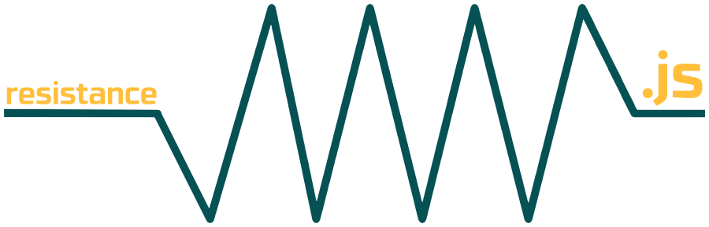

<p align="center">
  <a href="">
    
  </a>
</p>

<p align="center">
  Simple module to calculate electrical resistance in series and parallel circuits.
</p>

<p align="center">

  <a href="https://codeship.com/projects/"></a>

  <a href="https://travis-ci.org/mabrasil/resistance.js"></a>

  <a href="https://codeclimate.com/github/mabrasil/resistance.js"></a>

  <a href="https://david-dm.org/mabrasil/resistance.js" title="Dependency status"></a>

  <a href="https://david-dm.org/mabrasil/resistance.js#info=devDependencies" title="devDependency status"></a>

</p>

## Table of Contents

- [Installation](#installation)
- [Usage](#usage)
- [API](#api)
- [Understand the Topic](#understand-the-topic)
- [Development](#development)
- [Contributing](#contributing)
- [Motivation](#motivation)
- [License](#license)
- [Credits](#credits)

## Installation

```sh
$ npm install --save resistance.js
```

## Usage

```js
const resistance = require('resistance.js');

resistance([1, 2, 3], 'series');
//=> 6

resistance([1, 2, 3], 'parallel');
//=> 0.5454545454545455

console.log(resistance([1, 2, 3], 'series') + 'Ω')
//=> 6Ω
```

## API

### `resistance(circuit, type)`

#### `circuit`

*Type*: `array`

*Description*: Values of resistors associated in your circuit.

*Example*: `[1, 2, 3, 4]`

#### `type`

*Type*: `string`

*Description*: Type of resistors association in your circuit.

*Options*:

  - `'series'` or `'s'`: Resistors in series.
  - `'parallel'` or `'p'`: Resistors in parallel.

## Understand the Topic

Combinating resistors is very common in many circuits, when we want to reach a
resistance level which only one resistor is not enough.

### Resistors in Series

Let's take the following example:


In an association of series resistors, the equivalent resistor is equal to the
sum of all resistors that make up the association:

```
Req = R1 + R2 + R3 + R4 + ...
```

Also, the voltage in the electric generator is equal to the sum of all the
voltages of resistors:

```
V = V1 + V2 + V3 + V4 + ...
```

The electric current flowing in each resistor is always the same:

```
i = i1 = i2 = i3 = i4 ...
```

And the initial example becomes:


### Resistors in Parallel

Let's take the following example:


In an association of parallel resistors, the equivalent resistor is equal to
the inverse of the sum of all the inverted resistors which make up the
association:

```
1 / Req = (1 / R1) + (1 / R2) + (1 / R3) + (1 / R4) + ...
```

Also, the current in the equivalent resistor is equal to the sum of currents
from the resistors:

```
 i = i1 + i2 + i3 + i4 + ...
```

The voltage in the electric generator is always the same:

```
V = V1 = V2 = V3 = V4 = ...
```

And the initial example becomes:


## Development

All the tasks needed for development automation are defined in the
[`package.json`](package.json) *scripts* property and can be run via:

`npm run <command>`

Here is a summary of all the commands:

|  **Command**  |                                     **Description**                                      |
|---------------|------------------------------------------------------------------------------------------|
| `setup`       | Installs global Node dependencies needed for development.                                |
| `compile`     | Runs the Livescript compile on the source.                                               |
| `test:unit`   | Runs [Mocha](https://mochajs.org/) in BDD mode.                                          |
| `test:report` | Runs [Istanbul](https://github.com/gotwarlost/istanbul) coverage reports on Mocha tests. |
| `test`        | Runs both `test:unit` and `test:report` commands.                                        |
| `build`       | Runs both `compile` and `test` commands.                                                 |

## Contributing

Contributions are very welcome! If you'd like to contribute, these
[guidelines](CONTRIBUTING.md) may help you.

## Motivation

I was studying resistors association because of my *Constant Current* discipline
and then decided to put the basics into practice.

## License

[resistance.js](https://github.com/mabrasil/resistance.js) is distributed under
the MIT License, available in this repository. All contributions are assumed to
be also licensed under the MIT License.

## Credits

Some contents used in the [explanation section](#understand-the-topic) were
taken from [here](http://www.infoescola.com/fisica/associacao-de-resistores/).
